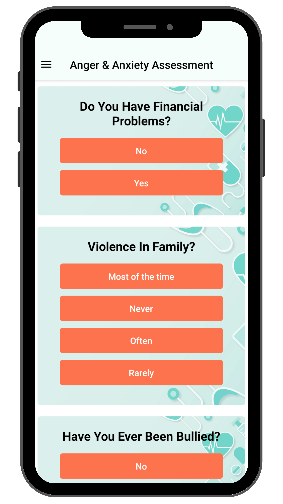

# Mental Health App: Anger and Anxiety Predictor

## Thesis Overview

Welcome to the repository for the Mental Health App developed as part of the thesis titled "Development of an Anger and Anxiety Disorder Prediction Scheme using Machine Learning and Mobile Application for Mental Healthcare." This app is designed to predict and assist in managing anger and anxiety through the implementation of various machine learning algorithms, coupled with a user-friendly mobile application.

## Abstract

This thesis explores the intersection of machine learning and mental healthcare, focusing on predicting anger and anxiety through a multi-class classification approach. The app employs algorithms such as Logistic Regression, Random Forest, SVM, KNN, and Decision Tree. The user-centric interface includes self-assessment tools, personalized recommendations, and professional resources to enhance user engagement and mental health awareness.

Through user feedback and assessment, the app's features are evaluated to showcase its effectiveness in empowering users to proactively manage their mental well-being. Additionally, the app facilitates quick access to support by helping users find psychologists, psychiatrists, and hospital information. Emergency contact information is readily available for immediate assistance. This research underscores the potential of technology to promote mental well-being and emphasizes continuous improvement and user-centric design in mental health applications.

## App Interfaces

1. **Register and Login User Interface**

   | Login                                      | Register                                      |
   | ------------------------------------------ | --------------------------------------------- |
   |  |  |

2. **Home & Navigation Interface**

   | Home                                       | Navigation                                       |
   | ------------------------------------------ | ------------------------------------------------ |
   |  |  |

3. **Anger & Anxiety Assessment Interface**

   | Assessment                                  | Assessment                                    | Outcome                                   |
   | ------------------------------------------- | --------------------------------------------- | ----------------------------------------- |
   |  |  |  |

4. **Physical Exercise Interface**

   | Exercise ||
   | --------------------------------------- ||
   |  ||

5. **Article Readings Interface**

   | Reading 1                              | Reading 2                                |
   | -------------------------------------- | ---------------------------------------- |
   |  |  |

6. **Find Doctors Interface**
   | Doctor |
   | --------------------------------------- |
   |  |

7. **Find Hospitals Interface**

   | Hospitals                                      | Google Map                                             |
   | ---------------------------------------------- | ------------------------------------------------------ |
   |  |  |

8. **Logout & Feedback Interface**

   | Logout                                         |
   | ---------------------------------------------- |
   |  |

## How to Run the App

```bash
git clone https://github.com/your-username/mental-health-app.git

cd mental-health-app

npm install

npm start

```
